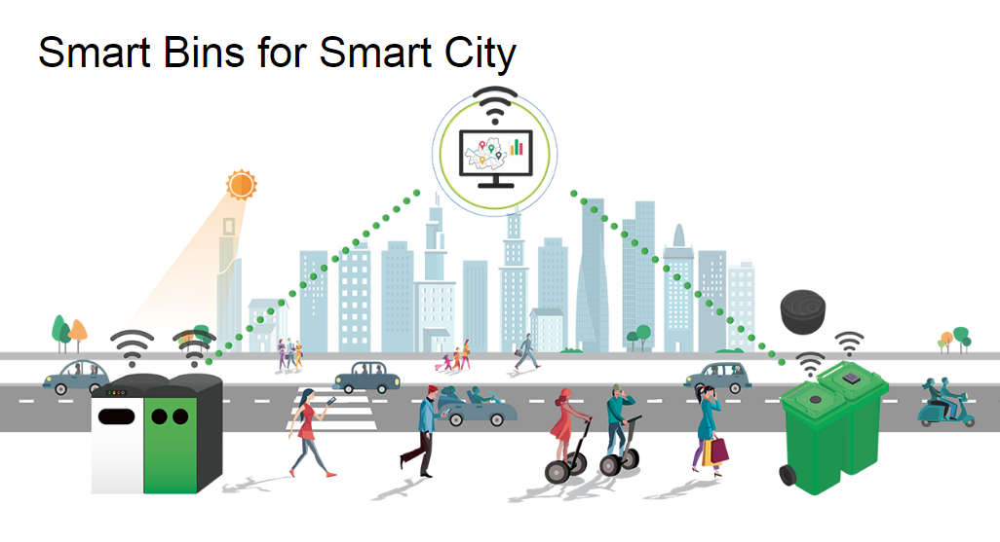

# Smart-Trash Bin
B.Tech Mini Project (6th Semester)

## Abstract
We often see that the garbage bins placed at public places overflow, creating unhygienic conditions. Most of the people are reluctant to dump the waste properly in the waste bins. Due to this the waste pile up near the bin and also produces bad odor. Improper waste management leads to environment pollution. The ultrasonic sensor attached to the bin will check the status of the bin i.e., whether the bin is full or not. This project proposes a smart waste management system that alerts the municipal authorities by displaying a flash message on respective mobile phones.

## Introduction
Waste management is one of the primary problems that the world faces in both a developed or developing country. Although some action has been taken from the government against this, poor management of waste has led to the emission of greenhouse gases. Hazardous wastes pollute the environment in various ways. Even before such wastes are safely disposed of, they pollute the air, water, soil and also pose a threat to human life. The key issue in the waste management is that the garbage bin at public places gets overflowed well in advance before the commencement of the next cleaning process. It, in turn, leads to various hazards such as bad odor & ugliness to that place which may be the root cause for the spread of various diseases
To avoid all such hazardous scenario and maintain public cleanliness and health this work is mounted on a smart garbage system. The main theme of the work is to develop a smart intelligent garbage alert system for a proper garbage management. This project proposes a smart alert system for garbage clearance by giving an alert signal to the municipal authorities for instant cleaning of dustbin with proper verification based on the level of garbage filling.

    
    

 <b>Description:</b> Illustration of the Smart City

## Components Used
- NodeMcu Board
- Breadboard
- Jumper wires
- 5V Supply
- Buzzer
- LED
- Soil Moisture sensor
- Ultrasonic sensor (HC-SR04)
- 1k Ohm Resistors
- 470 Ohm Resistors

## Module Description
The proposed system has two modules. The first one is E-monitoring system and the next is app interface system. The E-monitoring system deals with the hardware section whereas app interface system is the software part of the project.
### 1. E-monitoring System-
The three main components of this system are NodeMcu, ultrasonic sensor and moisture sensor. The ultrasonic sensor is used to determine if the waste bin is full or not. If the bin is full a flash message is displayed on the website. The motion sensor detects whenever waste is deposited in the bin and passes this information to NodeMcu. The NodeMcu is used to link all the information collected from the ultrasonic sensor to the app.

### 2. Web-Interface System-
The web interface system is regarding the app that keeps the authorities informed on the status of the trash bin. The user can use the app and will be given access to the app once the device ID of the user is registered in the app. The information collected from the sensors are linked to the app with the help of NodeMcu. The user can login to the app to check the status of the trash bin. The authority-user interface deals with the interaction of user and authority. When the waste overflows the bin, an alert message is received by the authorities and they can come and collect the waste from the waste bin.

## Description-
### 1. Node MCU-
The NodeMCU is an open-source firmware and development kit that helps you to Prototype your IOT product within a few 'C' codes. NodeMCU it is like Arduino Hardware with an Input Output built in the Board itself, it has also a Wi-Fi built-into connect directly to internet to control your things online for digital network applications, which facilitates developers to code running on the Board, Greatly speed up your Internet of Things application development process. The Development Board base on ESP8266 Chip, integrated GPIO(General Purpose Input Output), PWM(Pulse with Modulation), IIC(Interconnected Integrated Circuit), 1-Wire and ADC all in one board to power up your development board in a fastest way combined with the NodeMCU Firmware.

    

Source: <a href="https://github.com/irohan98/Smart-Trash/blob/main/Images/NodetoUltra.png">NodeMCU_Pins</a>

### 2. Ultrasonic sensor-
The ultrasonic sensor is a device that is used to measure the distance to an object with the help of sound waves. It sends out a high frequency sound pulse and determines how long it takes for the echo reflect back to it. The sensor has got a transmitter and a receiver on it to transmit-receive the sound pulse. The ultrasonic sensor can detect even the transparent objects as it can reflect off glass and liquid as well. It is resistant to mist and dirt. It also has the ability to detect complex shapes.

    

Source: <a href="https://github.com/irohan98/Smart-Trash/blob/main/Images/Ultrasonic Sensor.png">Ultrasonic Sensor</a>

### Interfacing Diagram 1-
The circuit connections are made as follows: 
- The HC-SR04 sensor attached to the board 
- The sensor Vcc is connected to the NodeMCU Vin (5V supply) 
- The sensor GND is connected to the NodeMCU GND 
- The sensor Trigger Pin is connected to the NodeMCU Digital I/O D4 (Sensor1) and D2 (Sensor 2)
- The sensor Echo Pin is connected to the NodeMCU Digital I/O D5 (Sensor 1) and D0 (Sensor 2)

**Note: Resistors of values 470 and 1k Ohms are added to protect the sensor from damage**

    <image src="Images/NodetoUltra.png" width=600>

Source: <a href="https://github.com/irohan98/Smart-Trash/blob/main/Images/NodetoUltra.png">Interfacing Diagram 1</a>

## Moisture sensor- 
Soil moisture is basically the content of water present in soil. This can be measured using a soil moisture sensor which consists of two conducting probes that act as a probe. It can measure the moisture content in the soil based on the change in resistance between the two conducting plates.

    

Source: <a href="https://github.com/irohan98/Smart-Trash/blob/main/Images/Moisture Sensor Pin-out.jpg">Moisture Sensor</a>

### Interfacing Diagram 2-
Connections are based on the analog mode of the moisture sensor. The Connections are as follows:
- Analog pin of the sensor is connected to pin A0 of the NodeMCU 
- The sensor Vcc is connected to +3.3 V
- The GND of the sensor id given to the GND of the NodeMCU

    <image src="Images/Nodetomois.png" width=600>

Source: <a href="https://github.com/irohan98/Smart-Trash/blob/main/Images/Nodetomois.png">Interfacing Diagram 2</a>

### Complete Circuit Diagram-

    <image src="Images/All_zoomout.png" width=800>

Source: <a href="https://github.com/irohan98/Smart-Trash/blob/main/Images/All_zoomout.png">Complete Circuit Diagram</a>

**Note: Make sure to add an indicator like an LED/Buzzer to any one of the NodeMCU pins for range detection alert or the Wet Waste alert**

Please refer to the code and make appropriate changes to your circuit and also check out the [blink app documentation](https://docs.blynk.cc/) to set up the mobile interface for the above project 

## Conclusion
A proper waste management system is important for the development of any country. For a populated country like India, waste management is an important concern. We are trying to give an effective solution to the waste management issue through this project.
